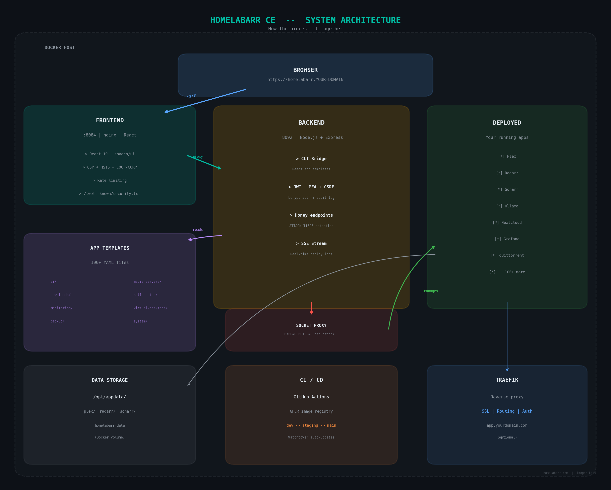

# HomelabARR CE

<p align="center">
    <a href="https://github.com/imogenlabs/homelabarr-ce">
      
    </a>
</p>

<p align="center"><strong>Your homelab, one dashboard.</strong></p>

<p align="center">
    <a href="https://github.com/imogenlabs/homelabarr-ce/releases/latest">
        
    </a>
    <a href="https://github.com/imogenlabs/homelabarr-ce/blob/main/LICENSE">
        
    </a>
    <a href="https://discord.gg/Pc7mXX786x">
        
    </a>
    <a href="https://wiki.homelabarr.com">
        
    </a>
    <a href="https://www.reddit.com/r/homelabarr/">
        
    </a>
</p>

<p align="center">
    <a href="https://github.com/imogenlabs/homelabarr-ce/actions/workflows/docker-build-push.yml">
        
    </a>
    <a href="https://github.com/imogenlabs/homelabarr-ce/actions/workflows/security-audit.yml">
        
    </a>
</p>

<p align="center">
    <a href="https://ce-demo.homelabarr.com">
        
    </a>
    <a href="https://homelabarr.com">
        
    </a>
    <a href="https://imogenlabs.ai">
        
    </a>
</p>

---

## What is HomelabARR?

You know how setting up self-hosted apps usually means Googling Docker Compose files, copying YAML, editing ports, and hoping it works? HomelabARR skips all of that.

It's a dashboard. You open it, you see 116 apps, you click **Deploy**, and the app is running. That's it.

Plex, Sonarr, Radarr, Jellyfin, Ollama, Home Assistant, qBittorrent — they're all in there, ready to go.

**Free and open source.** MIT license. No account required. No telemetry.

<p align="center">
    
</p>

---

## Try It Right Now

Don't want to install anything yet? [**Open the live demo →**](https://ce-demo.homelabarr.com)

Log in with `admin` / `admin`. Browse apps, click around. Nothing you do in the demo touches a real server.

---

## Install It (5 minutes)

You need a Linux machine with Docker installed.

```bash
# 1. Clone
git clone https://github.com/imogenlabs/homelabarr-ce.git /opt/homelabarr
cd /opt/homelabarr

# 2. Set three things
export JWT_SECRET=$(openssl rand -base64 32)
export DOCKER_GID=$(getent group docker | cut -d: -f3)
export CORS_ORIGIN=http://$(hostname -I | awk '{print $1}'):8084

# 3. Start it
docker compose -f homelabarr.yml up -d
```

Open `http://your-server-ip:8084`. Log in with `admin` / `admin`. **Change the password immediately.**

> **For a permanent setup**, move those exports into a `.env` file. See the [configuration docs](https://wiki.homelabarr.com/guides/configuration/) for the full list of options.

> **Don't have Docker?** Run `curl -fsSL https://get.docker.com | sh` first.

Want to build from source? See the [full install guide](https://wiki.homelabarr.com/guides/quick-start/).

---

## What You Get

- **116 apps, one click each.** Media servers, download clients, monitoring, AI tools, virtual desktops, backup, and more.
- **Three deployment modes.** Just IP:port, Traefik for SSL, or Traefik + Authelia for 2FA.
- **Manage running containers.** Start, stop, restart, remove, view logs.
- **Port Manager.** See every port in use across your stack.
- **Add your own apps.** Drop a YAML file in `apps/myapps/`.
- **Dark mode.** Obviously.
- **Mobile app.** iOS and Android — manage your homelab from the couch.

---

## App Catalog

| Category | # | Highlights |
|----------|---|------------|
| AI & Machine Learning | 14 | Ollama, Open WebUI, ComfyUI, Stable Diffusion, LocalAI |
| Media Servers | 5 | Plex, Jellyfin, Emby |
| Media Management | 15 | Sonarr, Radarr, Lidarr, Bazarr, Prowlarr |
| Downloads | 13 | qBittorrent, SABnzbd, NZBGet, Deluge, Transmission |
| Monitoring | 6 | Grafana, Netdata, Uptime Kuma, Tautulli |
| Self-hosted | 34 | Nextcloud, Vaultwarden, Immich, Home Assistant, n8n |
| System | 12 | Portainer, Dozzle, Watchtower, Traefik |
| Virtual Desktops | 10 | Kasm Workspaces, Firefox, Chrome, Tor Browser |
| Transcoding | 4 | Tdarr, Handbrake, MakeMKV |
| Backup | 3 | Duplicati, Restic |
| My Apps | — | Whatever you add |

Every template is a Docker Compose YAML file in `apps/<category>/`. Read them, edit them, or write your own.

---

## Architecture

Three containers. That's the whole stack.

| Service | What it does | Port |
|---------|-------------|------|
| **Frontend** | React dashboard served by nginx. What you see in your browser. | 8084 |
| **Backend** | Reads app templates, talks to Docker via socket proxy, handles auth. Node.js + Express. | 8092 |
| **Socket Proxy** | Mediates Docker API access. `EXEC=0`, `BUILD=0`, `cap_drop: ALL`, read-only. | internal |

<p align="center">
    
</p>

Want the deep dive? [Architecture docs →](https://wiki.homelabarr.com/guides/architecture/)

---

## Security

22-round security audit. 241+ findings shipped. [Full audit trail →](docs/audit/README.md)

| Layer | What ships |
|-------|-----------|
| **Auth** | JWT (HttpOnly cookies, 15-min TTL) + TOTP MFA + bcrypt cost 12 + CSRF double-submit |
| **API keys** | HMAC-SHA256 hashed, `hlr_` prefix, HKDF-derived subkey isolation |
| **Rate limiting** | 25 login attempts / 15 min per IP, account lockout at 15 failures, 100 req/min global |
| **Container hardening** | `cap_drop: ALL`, `read_only: true`, `no-new-privileges`, dumb-init PID 1, AppArmor |
| **Base images** | All pinned by `@sha256:` digest. cosign keyless signing + SBOM on every push. |
| **Encryption at rest** | SQLCipher AES-256 on all databases. Key rotation scripts included. |
| **Audit log** | Hash-chained tamper-evident log with daily rotation |
| **Headers** | CSP, HSTS (2yr + preload), COOP, CORP, Permissions-Policy, X-Frame-Options DENY |
| **Scanning** | Trivy on every image push, Dependabot daily, gitleaks on every commit |
| **Disclosure** | [SECURITY.md](SECURITY.md) + [/.well-known/security.txt](https://ce-demo.homelabarr.com/.well-known/security.txt) (RFC 9116) |

For the threat model (STRIDE analysis, trust boundaries, attack trees): [docs/threat-model/](docs/threat-model/README.md)
For incident response (11 playbooks): [docs/ir/](docs/ir/README.md)
For compliance posture (CIS Docker, NIST CSF, OWASP ASVS L2): [compliance/](compliance/)

**`JWT_SECRET` is required** (minimum 32 characters) — the server will not start without it. Generate one with `openssl rand -base64 32`.

Found a vulnerability? Email **michael@mjashley.com** — see [SECURITY.md](SECURITY.md).

---

## Production Deployment Checklist

1. **Bootstrap secrets:** `bash scripts/init-secrets.sh`
2. **Verify image signatures:** `cosign verify --certificate-identity-regexp '^https://github.com/imogenlabs/homelabarr-ce/' --certificate-oidc-issuer 'https://token.actions.githubusercontent.com' ghcr.io/imogenlabs/homelabarr-backend:<tag>`
3. **Start the stack:** `docker compose -f homelabarr.yml up -d`
4. **Encrypt the database** (first install only): `make encrypt-db`
5. **Verify health:** `curl -fsS https://<host>/api/health`
6. **Host firewall:** `sudo bash scripts/host-firewall-setup.sh`
7. **AppArmor:** `sudo bash scripts/install-apparmor.sh`
8. **Backups:** Install `scripts/backup-cron.sh` as a daily cron
9. **Subscribe** to Dependabot and Security alerts in GitHub repo settings

---

## Settings

| Setting | Required | What it does |
|---------|----------|-------------|
| `JWT_SECRET` | **Yes** | Signs login sessions. Generate with `openssl rand -base64 32`. |
| `DOCKER_GID` | **Yes** | Docker group ID on your host. |
| `CORS_ORIGIN` | **Yes** | The URL you open the dashboard at. |
| `DEFAULT_ADMIN_PASSWORD` | Optional | Default is `admin` — change it. |
| `TZ` | Optional | Your timezone. Defaults to `America/New_York`. |

All options: [wiki.homelabarr.com/guides/configuration](https://wiki.homelabarr.com/guides/configuration/)

---

## Repo Structure

```
homelabarr-ce/
├── src/              # React frontend (Vite + Tailwind 4 + shadcn/ui)
├── server/           # Node.js + Express backend (10 route modules)
│   ├── index.js      # App setup + middleware
│   ├── routes/       # auth, containers, deploy, health, ports, etc.
│   ├── auth.js       # JWT dual-key + MFA + API keys
│   └── audit.js      # Hash-chained tamper-evident log
├── apps/             # App templates (one YAML per app)
│   ├── ai/           # AI & machine learning
│   ├── downloads/    # Download clients
│   ├── media-servers/
│   ├── self-hosted/
│   ├── myapps/       # Your custom templates
│   └── ...
├── wiki/             # Source for wiki.homelabarr.com (MkDocs)
├── docs/             # Audit trail, threat model, IR runbook, governance
├── compliance/       # CIS Docker, NIST CSF, OWASP ASVS binders
├── .github/          # CI workflows, security policy
├── homelabarr.yml    # Production Docker Compose
└── nginx.conf.template  # nginx config (envsubst-rendered at container start)
```

---

## Development

```bash
npm install
npm run dev       # Dashboard on :5173 + API on :8092
npm run build     # Production build
npm test          # Test suite
```

See [CONTRIBUTING.md](CONTRIBUTING.md) for how to submit changes.

---

## Links

| | |
|---|---|
| **Website** | [homelabarr.com](https://homelabarr.com) |
| **Docs** | [wiki.homelabarr.com](https://wiki.homelabarr.com) |
| **Demo** | [ce-demo.homelabarr.com](https://ce-demo.homelabarr.com) — log in with admin / admin |
| **Security** | [SECURITY.md](SECURITY.md) · [/.well-known/security.txt](https://ce-demo.homelabarr.com/.well-known/security.txt) |
| **Discord** | [discord.gg/Pc7mXX786x](https://discord.gg/Pc7mXX786x) |
| **Reddit** | [r/homelabarr](https://www.reddit.com/r/homelabarr/) |
| **Company** | [imogenlabs.ai](https://imogenlabs.ai) |
| **Developer** | [mjashley.com](https://mjashley.com) |

---

## Contributors

<table>
<tr>
    <td align="center"><a href="https://github.com/smashingtags"><br /><sub><b>smashingtags</b></sub></a></td>
    <td align="center"><a href="https://github.com/fscorrupt"><br /><sub><b>FSCorrupt</b></sub></a></td>
    <td align="center"><a href="https://github.com/drag0n141"><br /><sub><b>DrAg0n141</b></sub></a></td>
    <td align="center"><a href="https://github.com/aelfa"><br /><sub><b>Aelfa</b></sub></a></td>
    <td align="center"><a href="https://github.com/cyb3rgh05t"><br /><sub><b>cyb3rgh05t</b></sub></a></td>
    <td align="center"><a href="https://github.com/justinglock40"><br /><sub><b>justinglock40</b></sub></a></td>
    <td align="center"><a href="https://github.com/mrfret"><br /><sub><b>mrfret</b></sub></a></td>
</tr>
<tr>
    <td align="center"><a href="https://github.com/dan3805"><br /><sub><b>DoCtEuR3805</b></sub></a></td>
    <td align="center"><a href="https://github.com/brtbach"><br /><sub><b>brtbach</b></sub></a></td>
    <td align="center"><a href="https://github.com/ramsaytc"><br /><sub><b>ramsaytc</b></sub></a></td>
    <td align="center"><a href="https://github.com/Shayne55434"><br /><sub><b>Shayne</b></sub></a></td>
    <td align="center"><a href="https://github.com/Nossersvinet"><br /><sub><b>Nossersvinet</b></sub></a></td>
    <td align="center"><a href="https://github.com/ookla-ariel-ride"><br /><sub><b>Ookla, Ariel, Ride!</b></sub></a></td>
</tr>
<tr>
    <td align="center"><a href="https://github.com/townsmcp"><br /><sub><b>James Townsend</b></sub></a></td>
    <td align="center"><a href="https://github.com/red-daut"><br /><sub><b>Red Daut</b></sub></a></td>
    <td align="center"><a href="https://github.com/DomesticWarlord"><br /><sub><b>DomesticWarlord</b></sub></a></td>
</tr>
</table>

## License

[MIT](LICENSE) — do whatever you want with it.
