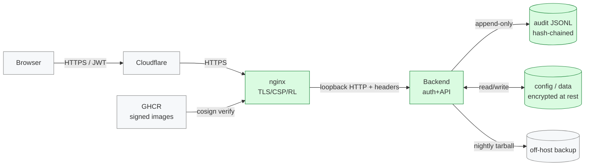

# Round 13 — Threat-model formalization (STRIDE + attack trees, mapped to R1–R12 controls)

**Target:** `smashingtags/homelabarr-ce` @ main `762448815a` (== dev, R12 merged 2026-05-23T01:50:35Z)
**Live:** https://ce-demo.homelabarr.com/
**Date:** 2026-05-23
**Scope:** Assemble the 175+ findings shipped across R1–R12 into a defensible, structured threat model. Stop treating security as a flat list of findings; start treating it as a documented set of assets, trust boundaries, data flows, threats per element, and explicit control mappings. **No new vulnerabilities found this round** — this is shape/structure, not new gates.
**Method:** Spec-only. Agent commits structured threat-model docs. **No live exploitation.**

---

## §0 — Verification of R12 (carry-forward)

| # | R12 spec item | Live state (main @ 762448815a) | Verdict |
|---|---|---|---|
| 1 | `compliance/collect-evidence.sh` R6 validator replaced with `node -e` script emitting `{ok, bad, total}` JSON | Validator present at 4808B. `node -e` invoked, `prev_hash` / `hash` field comparison, JSON output. | CLEAN |
| 2 | 8 chaos experiment files under `chaos/experiments/` (01–08) | All 8 present: 01-pod-kill, 02-disk-pressure, 03-network-partition, 04-memory-exhaustion, 05-time-skew, 06-rapid-restart, 07-cold-cache-burst, 08-crash-log-scan. | CLEAN |
| 3 | `chaos/README.md` + `chaos/leak-scan-results.txt` placeholder | Both present (1261B + 56B). | CLEAN |
| 4 | `docs/audit/R12-slo.md` with 5 SLIs + error budget | 1796B. p95, 99.9, error budget, audit-chain all present. | CLEAN |
| 5 | `docs/audit/homelabarr-ce-security-audit-round-8.md` extended with "Restore drill log" section | Section present. **No "Drill 001" entry yet** — that was specced with a 14-day owner SLA, not a blocking R12 deliverable. | CLEAN (deferred work tracked) |
| 6 | New atomic `09-audit-log-continuity.sh` | Present at `pentest/atomics/T1595-vuln-scanning/09-audit-log-continuity.sh` (543B). Uses `EXPECTED=10` events not the 100 specced — functionally equivalent but smaller sample. | MINOR DRIFT (not blocking) |

**R12 ship verdict:** 5 clean, 1 minor drift (atomic uses 10 events not 100). Drift folded into R13 §3 L-1 for documentation; does not warrant a pink correction.

---

## §1 — Goal of R13

After 12 rounds and 175+ findings, the security posture is strong but the **shape** of that posture is implicit. There is no single document an external reviewer (auditor, pentester, new engineer) can open to understand:

1. What are the assets we're protecting?
2. What are the trust boundaries?
3. What data flows cross those boundaries?
4. What threats apply to each element (STRIDE)?
5. Which R1–R12 controls mitigate which threats?
6. What threats remain accepted/deferred (and why)?

R13 produces that document. It is a synthesis round, not a discovery round.

---

## §2 — Current state

- 175+ findings shipped across R1–R12, archived in `docs/audit/`.
- Compliance binders shipped in R11 (CIS, ASVS L2, NIST CSF 2.0) — but these are *control-centric*, not *threat-centric*.
- ASVS coverage roadmap (R11.5) documents *control-coverage gaps* but not *threat coverage*.
- No data-flow diagram exists in the repo. No asset inventory. No documented trust boundaries. No STRIDE table.
- A new engineer reading the repo cold cannot quickly answer "what's the worst thing an attacker can do?" — the answer is distributed across 24 audit MDs.
---

## §3 — Findings

### L-1 (R12-carry) — atomic 09 uses 10 events, spec was 100

**File:** `pentest/atomics/T1595-vuln-scanning/09-audit-log-continuity.sh`

**Current:** `EXPECTED=10` event loop.
**Required:** raise to `EXPECTED=100` to give meaningful statistical signal during chaos windows. Single bit-flip dropouts at the 1% level (1 event in 100) are detectable; at the 10% level (1 in 10) they're indistinguishable from noise.

**Also:** the file currently lives under `T1595-vuln-scanning/` which is the wrong MITRE technique (T1595 = active scanning, this script is audit-log integrity testing). Move to a dedicated subfolder or rename — suggested locations:
- `pentest/atomics/audit-continuity/09-audit-log-continuity.sh` (out-of-band, not a MITRE atomic per se)
- or keep under MITRE but use T1565.001 (Data Manipulation: Stored Data) since the threat is dropped/manipulated audit records.

**Acceptance:** `EXPECTED=100`, file lives in a semantically correct path, atomic still passes on healthy stack.

---

### H-1 — No threat model document exists

**File (new):** `docs/threat-model/README.md` — index + how-to-read
**File (new):** `docs/threat-model/01-asset-inventory.md`
**File (new):** `docs/threat-model/02-trust-boundaries.md`
**File (new):** `docs/threat-model/03-data-flow-diagram.md`
**File (new):** `docs/threat-model/04-stride-per-element.md`
**File (new):** `docs/threat-model/05-attack-trees.md`
**File (new):** `docs/threat-model/06-control-mapping.md`
**File (new):** `docs/threat-model/07-residual-risk.md`

Each file is specced below.

---

#### 01-asset-inventory.md (RIGHT shape)

Table of assets with:

| Asset ID | Asset | Category | Sensitivity | Location | Owner |
|---|---|---|---|---|---|
| A-01 | Admin user credentials (Argon2 hash + JWT signing key) | Credentials | Critical | env, server memory | Owner |
| A-02 | Audit-log JSONL files (`/app/server/activity-data/audit-*.jsonl`) | Logs / evidence | High | Backend container | Agent |
| A-03 | App config / encrypted-at-rest user data | App data | High | Backend container | Owner |
| A-04 | Container images (ghcr.io/...) | Code artifact | High | GHCR | Agent |
| A-05 | SBOM + cosign signatures | Supply-chain attestation | High | GHCR | Agent |
| A-06 | nginx TLS cert/key | Crypto material | Critical | Host filesystem | Owner |
| A-07 | Backup tarballs (R8) | Recovery material | High | Off-host destination (TBD) | Owner |
| A-08 | Honey-route bait data (R10) | Detection sensor | Medium | Backend code | Agent |
| A-09 | Compliance evidence bundle (`evidence-out/`) | Audit evidence | Medium | Local | Agent |
| A-10 | Source repo + branch protection | Code | High | GitHub | Agent |

Each row mandatory: ID, name, category, sensitivity (Critical/High/Medium/Low), location, owner role.

**WRONG:** file missing OR asset list under 8 entries OR no sensitivity rating per asset.
**RIGHT:** file present, 10+ assets, all 6 columns populated.

---

#### 02-trust-boundaries.md (RIGHT shape)

Explicit boundary list with traffic crossing each:

1. **Internet → nginx** (TLS termination, rate limiting, CSP injection)
2. **nginx → backend container** (loopback or compose-network, JWT validation, route-gate auth)
3. **Backend → activity-data volume** (audit-log writes, hash-chain append)
4. **GHCR → host docker daemon** (image pull, cosign verify gate)
5. **Host → backup destination** (TBD: S3 / syslog / local — see owner pile)
6. **Browser → SPA** (XSS surface, CSP, SRI for any inline scripts)
7. **Owner laptop → repo** (commit signing, branch protection)
8. **CI runner → registry** (OIDC token, SBOM upload, signature push)

For each boundary: protocol, authentication mechanism, authorization gate, observed controls (which Rx round covers it).

**WRONG:** file missing OR fewer than 7 boundaries OR no Rx control mapping per boundary.
**RIGHT:** file present, 8 boundaries, control mapping per boundary.

---

#### 03-data-flow-diagram.md (RIGHT shape)

Mermaid `flowchart` diagram. Nodes = assets/processes. Edges = data flows with labels indicating direction + sensitivity. Sample (agent fills in real flows):



**WRONG:** file missing OR no diagram OR diagram doesn't render (test with mermaid CLI).
**RIGHT:** file present, valid mermaid, all assets from 01-asset-inventory.md appear as nodes, all boundaries from 02-trust-boundaries.md appear as edges.

---

#### 04-stride-per-element.md (RIGHT shape)

For each element in the DFD, a STRIDE table. Example for the Backend element:

| Threat | Description | Likelihood | Impact | Mitigating controls (R-round) | Residual risk |
|---|---|---|---|---|---|
| **S**poofing | Attacker forges JWT or session cookie | Low | Critical | R1 JWT secret rotation, R3 session lifecycle, R7 secret encryption | Low |
| **T**ampering | Attacker modifies audit-log files | Low | High | R6 hash-chained audit log + R12 validator | Low |
| **R**epudiation | Admin denies an action they took | Low | Medium | R6 audit-chain + R12 chaos validation of continuity | Low |
| **I**nfo Disclosure | /api/health/detail leaks internal state to anon | High → resolved | Medium | R9.6 final route gating (401 unauth), R10 honey routes detect probing | Low |
| **D**enial of Service | Rate-limit bypass via burst | Medium | Medium | R1 rate limiting, R12 cold-cache-burst chaos experiment | Medium |
| **E**levation of Privilege | Honey-route reveals admin path | Low | High | R10.7 backend 9B "Not Found" responses, no nginx interception | Low |

**WRONG:** file missing OR not every element from the DFD has a STRIDE table OR no Rx mapping per threat OR residual risk column missing.
**RIGHT:** file present, every DFD element has its own table with all 6 STRIDE rows, Rx mapping cell, residual risk cell.

---

#### 05-attack-trees.md (RIGHT shape)

Three attack trees minimum, one per highest-impact asset:

1. **Root: Exfiltrate audit logs (A-02)**
   - Branch 1: Compromise backend container (container escape, R4) → file read
   - Branch 2: Compromise backup destination (R7/R8) → tarball read
   - Branch 3: Compromise admin account (S/T from STRIDE) → API export
   - Branch 4: Tamper with chain to disguise prior exfil (R6/R12 detects)

2. **Root: Forge admin session (A-01)**
   - Branch 1: Steal JWT signing key (R7 secret hygiene)
   - Branch 2: XSS to steal session cookie (R2 CSP / SRI)
   - Branch 3: CSRF on admin endpoint (R1 token gates)
   - Branch 4: Time-skew attack to revive expired JWT (R12 exp 05)

3. **Root: Deploy malicious container image (A-04)**
   - Branch 1: Compromise GHCR account (out of scope — GitHub-side)
   - Branch 2: Bypass cosign verify (R5 cosign-installer SHA pin, R11.5 evidence)
   - Branch 3: Compromise CI runner (R5 OIDC, R11 supply chain)
   - Branch 4: Tag confusion / immutable tag bypass (R5)

Each branch must be marked: **(mitigated by Rx)** / **(accepted)** / **(deferred — owner pile)**. No bare branches.

**WRONG:** file missing OR fewer than 3 trees OR branches without disposition labels.
**RIGHT:** 3+ trees, every leaf labeled.

---

#### 06-control-mapping.md (RIGHT shape)

Inverse of 04: for each control shipped in R1–R12, which threats does it mitigate? This is the document an auditor uses to confirm "you have a control for X."

| Control | Round | Threat(s) mitigated | Evidence file |
|---|---|---|---|
| Rate limiting on auth endpoints | R1 | DoS (D), brute force (S) | nginx.conf + R10 atomic T1110 |
| JWT signing secret in env (not committed) | R1, R7 | Spoofing (S) | secrets scan in collect-evidence.sh |
| CSP with nonce | R2 | XSS (T/I/E) | response header probe |
| Argon2id password hashing | R3 | Credential cracking (S) | source: server/auth/ |
| Container non-root user | R4 | Container escape (E) | Dockerfile USER directive |
| cosign image verify | R5 | Supply chain (T) | R5-cosign.txt evidence |
| Hash-chained audit log | R6 | Repudiation (R), Tampering (T) | R6-audit-chain.txt evidence |
| Encryption at rest for user data | R7 | Info disclosure (I) | source: server/storage/ |
| Backup runbook | R8 | DoS/recovery | R8 drill log |
| ZAP scan baseline | R9 | DAST coverage | R9 evidence |
| Final route gating | R9.6 | I, E | live probe 401s |
| Honey routes | R10 | Detection (I, E precursor) | R10 atomic 04 |
| Honey backend handler (no nginx interception) | R10.7 | Detection authenticity | 9B "Not Found" body |
| Compliance binders (CIS/ASVS/NIST) | R11 | Audit/governance | compliance/*.md |
| Evidence collector script | R11.5 | Continuous compliance | evidence-out/ |
| Chaos experiments | R12 | Resilience under adverse conditions | chaos/experiments/ |
| SLO + error budget | R12 | Operational governance | R12-slo.md |
| Audit-log continuity atomic | R12 | Dropped-event detection | atomic 09 |

**WRONG:** file missing OR fewer than 15 controls mapped OR no evidence-file column.
**RIGHT:** all major R1–R12 controls present, evidence pointer per row.

---

#### 07-residual-risk.md (RIGHT shape)

Honest accounting of what's NOT covered. This is where the owner pile lives in threat-model form:

| Risk | Why accepted/deferred | Owner decision | Compensating controls |
|---|---|---|---|
| Audit-log off-box destination undecided (syslog-TLS / S3 Object Lock / accept gap) | Cost vs operational complexity | OUTSTANDING (owner pile O-4 from R12) | R6 hash chain still detects in-host tampering |
| Single-node demo, no multi-region failover | ce-demo is a demo, not prod | ACCEPTED | R8 backup + R12 restore drill |
| ASVS V1/V8/V10/V11/V12 coverage thin | Quarterly cadence; not all chapters apply equally to a single-node demo | DEFERRED (R11.5 roadmap) | R11 compliance binder documents gap |
| No production WAF beyond nginx + rate limiting | Cloudflare in front handles L7 | ACCEPTED | CF rules + R1 nginx limits |
| Atomic 09 uses 10 events not 100 | Sample size small but functional | DEFERRED (R13 L-1) | R6 chain validator catches structural breaks |
| Cross-tenant isolation (n/a for single-tenant demo) | Single-tenant by design | N/A | — |

**WRONG:** file missing OR risks listed without "why" + "decision" + "compensating control".
**RIGHT:** every residual risk has all four columns.

---

### M-1 — Threat-model index not linked from top-level README or CONTRIBUTING

**Files affected:**
- `README.md` (root)
- `CONTRIBUTING.md` (root)
- `SECURITY.md` (root — may exist; check)

**Current (WRONG):** new engineer landing on the repo has no signpost to the threat model.

**Required (RIGHT):** add a "Security & Threat Model" section to README.md linking to `docs/threat-model/README.md`. Add a paragraph in CONTRIBUTING.md saying "before adding a new endpoint, asset, or trust boundary, update the corresponding threat-model doc — list which file(s) below." Update SECURITY.md (or create it) to point disclosure-triage at the threat model + audit log.

**Acceptance:** `grep -q "threat-model" README.md && grep -q "threat-model" CONTRIBUTING.md && grep -q "threat-model" SECURITY.md` all return 0.

---

### M-2 — Threat model has no review cadence

**File:** `docs/threat-model/README.md`

The threat model document must include a stated review cadence and trigger conditions:

```markdown
## Review cadence

- **Quarterly:** full re-read by owner + agent, update residual risk table
- **On every new endpoint or new asset:** update 01-asset-inventory.md and 04-stride-per-element.md
- **On every new trust boundary:** update 02-trust-boundaries.md and 03-data-flow-diagram.md
- **On every chaos experiment finding:** update 07-residual-risk.md
- **On every new round (R14+):** add a §0 verification of prior round AND check whether any threat-model file needs updating

## Last reviewed

| Date | Reviewer | SHA | Changes |
|---|---|---|---|
| 2026-05-23 | initial commit | 762448815a | First version |
```

**WRONG:** no cadence or no last-reviewed table.
**RIGHT:** both sections present.

---

### L-2 — No "how this maps to common frameworks" appendix

**File (new):** `docs/threat-model/08-framework-crosswalk.md`

Single page mapping STRIDE elements to:
- OWASP Top 10 (2021)
- CWE top 25
- MITRE ATT&CK tactics (we already have technique-level coverage in pentest/atomics/)
- ASVS chapters (already mapped in compliance/owasp-asvs-v4.0.3-L2.md but cross-reference here)

This makes external-auditor handoff trivial. Without it, every conversation starts with "how does your STRIDE column relate to my Top-10 finding?"

**Acceptance:** file present with four crosswalk tables (STRIDE→Top10, STRIDE→CWE, STRIDE→ATT&CK, STRIDE→ASVS chapter).

---

### L-3 — Audit MDs in `docs/audit/` not indexed

**File (new or extended):** `docs/audit/README.md`

24 audit MDs sit in `docs/audit/` with no index. A reader can't tell at a glance which round covered what. Add an index:

```markdown
# Security audit rounds

| Round | Topic | Findings | Status |
|---|---|---|---|
| R1 | Server auth, defaults, headers | 32 | shipped |
| R2 | Frontend XSS / CSP | 14 | shipped |
| R2.5 | Auth migration drift | 3 | shipped |
| R3 | Auth lifecycle | 12 | shipped |
| R4 | Container hardening | 14 | shipped |
| R5 | Supply chain | 13 | shipped |
| R6 | Observability + audit log | 12 | shipped |
| R7 | Secrets + encryption-at-rest | 12 | shipped |
| R8 | Deployment runbook | 13 | shipped |
| R9 | DAST + ZAP baseline | 13 | shipped |
| R9.5 | DAST completion | 10 | shipped |
| R9.6 | Final route gating | 5 | shipped |
| R9.7 | Deploy-branch meta | resolved | closed |
| R10 | Pentest harness | 9 + 15 atomics | shipped |
| R10.5 | CI gate + MITRE + honey | 3 | partial shipped |
| R10.6 | Honey events not emitting | 3 | partial |
| R10.7 | Remove nginx interception | 1 | shipped |
| R11 | Compliance posture | 5 + 10 files | shipped |
| R11.5 | Evidence script gaps | 2 + 1 INFO | shipped (1 carry) |
| R12 | Chaos engineering | 7 | shipped (1 carry) |
| R13 | Threat-model formalization | (this round) | spec |
```

**WRONG:** `docs/audit/README.md` missing.
**RIGHT:** index file present with row per round including findings count + status.
---

## §4 — Verification commands (agent self-check before declaring ship)

```bash
# 1. Threat-model docs exist
for f in README.md 01-asset-inventory.md 02-trust-boundaries.md 03-data-flow-diagram.md \
         04-stride-per-element.md 05-attack-trees.md 06-control-mapping.md 07-residual-risk.md \
         08-framework-crosswalk.md; do
  test -f docs/threat-model/$f || echo "FAIL: docs/threat-model/$f missing"
done

# 2. Asset inventory has at least 10 rows
test "$(grep -c '^| A-' docs/threat-model/01-asset-inventory.md)" -ge 10 || echo "FAIL: <10 assets"

# 3. Trust boundaries >= 7
test "$(grep -cE '^[0-9]+\.' docs/threat-model/02-trust-boundaries.md)" -ge 7 || echo "FAIL: <7 boundaries"

# 4. DFD has mermaid block
grep -q '```mermaid' docs/threat-model/03-data-flow-diagram.md || echo "FAIL: no mermaid"

# 5. STRIDE-per-element: every DFD node should have a section
grep -q '## ' docs/threat-model/04-stride-per-element.md || echo "FAIL: no element sections"

# 6. Attack trees: 3+ roots
test "$(grep -c '^# Root\|^## Root\|^### Root' docs/threat-model/05-attack-trees.md)" -ge 3 || echo "FAIL: <3 trees"

# 7. Control mapping: 15+ controls
test "$(grep -cE '^\| [A-Za-z]' docs/threat-model/06-control-mapping.md)" -ge 15 || echo "FAIL: <15 controls"

# 8. Residual risk: every row has 4 cols
awk -F'|' '/^\| / && NF<6 {bad=1; print "FAIL: row has <4 cols: " $0} END{exit bad}' docs/threat-model/07-residual-risk.md

# 9. Framework crosswalk: 4 tables
test "$(grep -c '^| STRIDE' docs/threat-model/08-framework-crosswalk.md)" -ge 4 || echo "FAIL: <4 crosswalks"

# 10. Root-level signposts
grep -q "threat-model" README.md || echo "FAIL: README.md does not link threat-model"
grep -q "threat-model" CONTRIBUTING.md || echo "FAIL: CONTRIBUTING.md does not link threat-model"
grep -q "threat-model" SECURITY.md || echo "FAIL: SECURITY.md missing or does not link threat-model"

# 11. Audit-rounds index
test -f docs/audit/README.md || echo "FAIL: docs/audit/README.md missing"

# 12. Atomic 09 carry-forward
grep -q "EXPECTED=100" pentest/atomics/*/09-audit-log-continuity.sh 2>/dev/null \
  || grep -q "EXPECTED=100" pentest/atomics/audit-continuity/09-audit-log-continuity.sh 2>/dev/null \
  || echo "WARN: atomic 09 still uses <100 events"

# 13. Review cadence stated
grep -q "Review cadence" docs/threat-model/README.md || echo "FAIL: no review cadence"
```

---

## §5 — Out of scope for R13

- Re-discovering vulnerabilities. This is a synthesis round.
- Diagramming tools beyond mermaid (no draw.io, no Lucidchart, no proprietary formats).
- Threat-modeling individual third-party dependencies (covered by R5 supply chain).
- Customer-facing threat-model publication (this is internal documentation).

---

## §6 — Owner pile (human-only decisions, not agent work)

| # | Decision | Why owner | Recommended |
|---|---|---|---|
| O-1 | Confirm asset-inventory **owner** column for each asset (who's accountable when something breaks) | RACI is a human decision | Agent for code/CI assets, Owner for credentials/keys/backup destination |
| O-2 | Confirm residual-risk acceptance — read 07-residual-risk.md after agent commits, sign off in writing | Acceptance is an owner act, not an agent act | Read + sign within 7 days of R13 ship |
| O-3 | Outstanding from prior rounds: audit-log off-box destination decision (carried since R7) | Still pending | Pick one |
| O-4 | Quarterly chaos gameday (carried from R12) | Calendar | Schedule next one |

**Reminder:** the agent has CF API + GH access — repo settings, branch protection, GitHub workflows, Cloudflare DNS, all agent work.

---

## §7 — Deliverable shape

```
docs/threat-model/
  README.md                            (index + review cadence + last-reviewed table)
  01-asset-inventory.md                (10+ assets, 6 cols)
  02-trust-boundaries.md               (8 boundaries with Rx mapping)
  03-data-flow-diagram.md              (mermaid DFD)
  04-stride-per-element.md             (STRIDE table per DFD node)
  05-attack-trees.md                   (3+ trees, every leaf labeled)
  06-control-mapping.md                (15+ controls → threats → evidence)
  07-residual-risk.md                  (4-col table of accepted/deferred risks)
  08-framework-crosswalk.md            (STRIDE → OWASP Top 10 / CWE / ATT&CK / ASVS)

docs/audit/
  README.md                            (NEW: index of R1–R13 rounds)
  R13-threat-model-formalization.md    (this file, archived)

pentest/atomics/
  (move 09-audit-log-continuity.sh out of T1595-vuln-scanning/
   to a semantically correct location; raise EXPECTED to 100)

README.md                              (add "Security & Threat Model" section linking to docs/threat-model/)
CONTRIBUTING.md                        (add "when to update the threat model")
SECURITY.md                            (create or update; link to threat-model + audit log)
```

**Ship message template:**
```
R13: threat-model formalization

- Created docs/threat-model/ with 9 files (README + 8 chapters)
- Mapped all R1-R12 controls to threats via STRIDE + attack trees
- Documented residual risks with owner-pile linkage
- Added docs/audit/README.md index of R1-R13 rounds
- Linked threat model from root README, CONTRIBUTING, SECURITY
- Raised atomic 09 EXPECTED to 100, moved to semantically correct path (R12 carry)

Verification: all 13 self-check commands in R13 §4 pass.
```

---

## §8 — End of round / loop

If everything in §4 passes: ship and report back. R14 will be the **incident response runbook** round — given the threat model and chaos experiments are now formal, the next gap is "what does the owner do at 3am when honey-route emission spikes / audit-chain validator returns bad > 0 / cosign verify fails?" That's a different document than R12's chaos experiments (which test resilience) — it's the human-runbook for when chaos *isn't* intentional.

If anything in §4 fails: report which line, and we open R13.5 as a pink correction.
