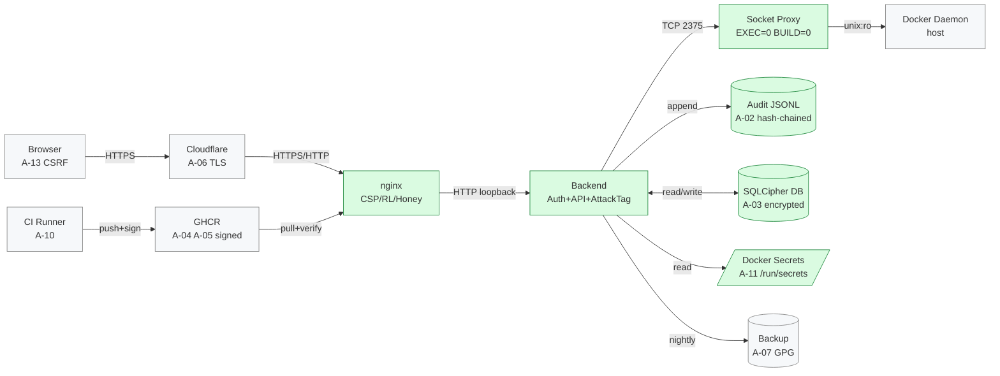

# Data Flow Diagram

```mermaid
flowchart LR
  USER[Browser<br/>A-13 CSRF]:::ext
  CF[Cloudflare<br/>A-06 TLS]:::ext
  NGINX[nginx<br/>CSP/RL/Honey]:::ours
  BE[Backend<br/>Auth+API+AttackTag]:::ours
  PROXY[Socket Proxy<br/>EXEC=0 BUILD=0]:::ours
  DOCKER[Docker Daemon<br/>host]:::ext
  AUDIT[(Audit JSONL<br/>A-02 hash-chained)]:::ours
  DB[(SQLCipher DB<br/>A-03 encrypted)]:::ours
  SECRETS[/Docker Secrets<br/>A-11 /run/secrets/]:::ours
  GHCR[GHCR<br/>A-04 A-05 signed]:::ext
  BACKUP[(Backup<br/>A-07 GPG)]:::ext
  CI[CI Runner<br/>A-10]:::ext

  USER -- HTTPS --> CF
  CF -- HTTPS/HTTP --> NGINX
  NGINX -- HTTP loopback --> BE
  BE -- TCP 2375 --> PROXY
  PROXY -- unix:ro --> DOCKER
  BE -- append --> AUDIT
  BE <-- read/write --> DB
  BE -- read --> SECRETS
  GHCR -- pull+verify --> NGINX
  BE -- nightly --> BACKUP
  CI -- push+sign --> GHCR

  classDef ext fill:#f6f8fa,stroke:#888
  classDef ours fill:#dafbe1,stroke:#1f883d
```
